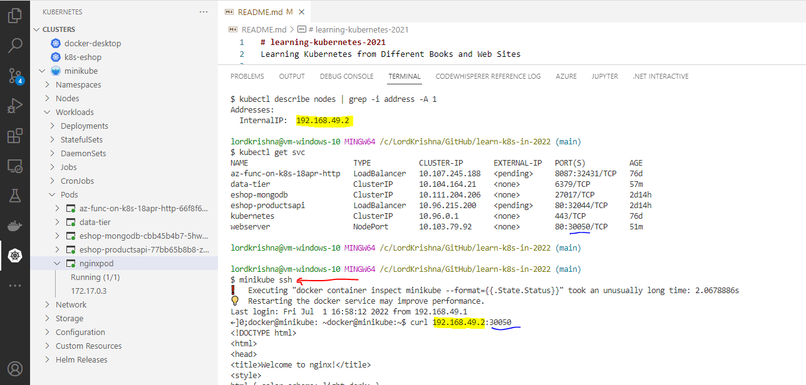

# learning-kubernetes-2021

Learning Kubernetes from Different Books and Web Sites

## Accessing the POD Inside Minikube

Note:

> 1. To retrieve the Internal IP Address of the POD, run the following command:
>
> ```
> kubectl describe nodes | grep -i address -A 1
> ```
>
> 1. Using `InternalIP` using the following command **curl 192.168.49.2:30050**
> 1. Using `CLUSTER-IP` using the following command **curl 10.103.79.92**


